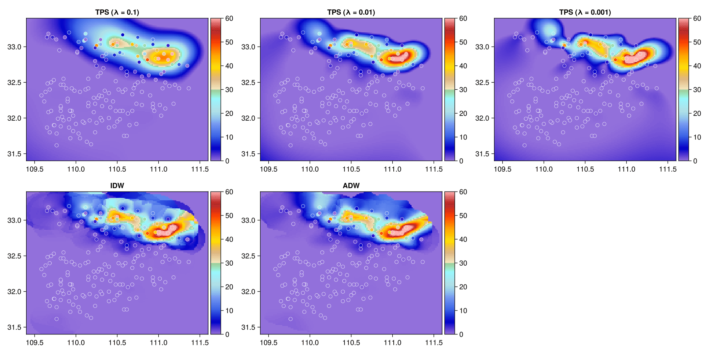

<!--  -->

## Functions

*Interpolation (point to raster)*

- [x] Thin Plate Spline Interpolation (tps)
- [x] Angular Distance Weighting Interpolation (adw)
- [x] Inverse Distance Weighting Interpolation (idw)
- [x] Nearest Interpolation (nearest)
- [x] Bilinear Interpolation

